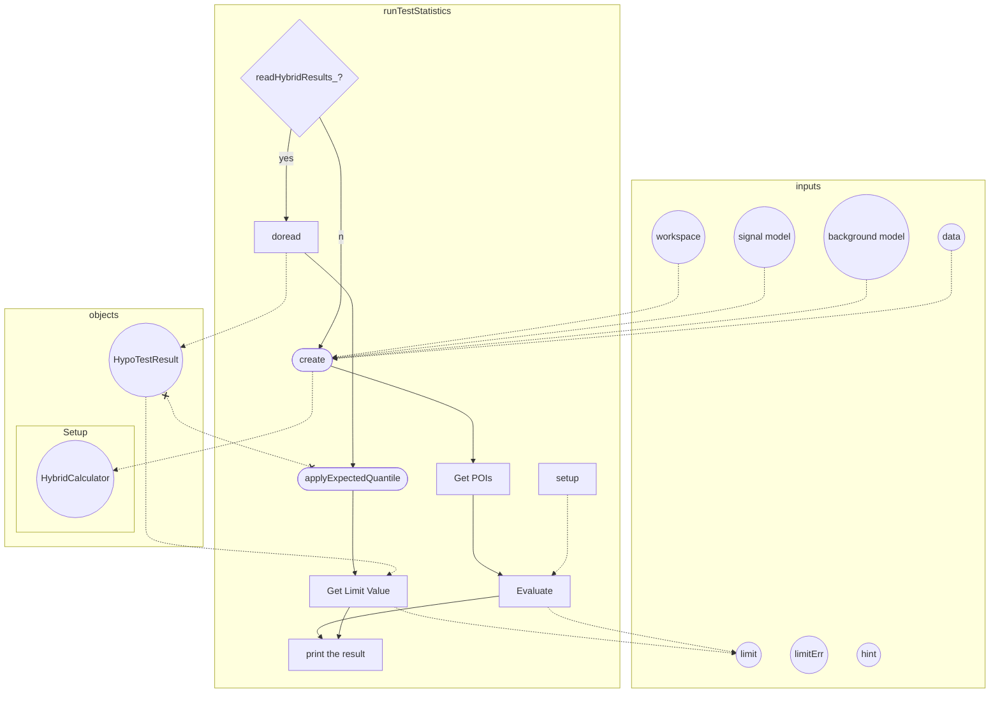

# overview

# ChannelCompatibilityCheck

# run method 

   First gets the parameter of interest and the RooSimultaneousPDf 
   
   Then loops over channels and gets the pdf for each channel
   then replaces the POI in each channel pdf with a new POI specific to that channel
   and adds this new channel pdf to a new SimultaneousPDF created for the full fit

   creates a `CascadeMimizer` object and 

...


# AsymptoticLimits

Calculates the expected and observed limits using the asymptotic formulae from https://arxiv.org/abs/1007.1727

particularly using as the test statistic either qmu or qmu(tilde)
which use the log likelihood ratio  for r > r\_bestfit and 0 otherwise.
qmu(tilde) uses the additional change that if r\_bestfit < 0, then the ratio is taken with respect to the likelihood at r=0, rather than at r\_bestfit.

For the asymptotic approximation, the pdf of these test statistics is calculated in the paper using the Wald approximation.
from the calculation of this pdf, relations for the CLs limits can be found and are given in
cms.cern.ch/iCMS/jsp/openfile.jsp?tp=draft&files=AN2011_298_v3.pdf

in particular:
CL_s  = (1 - normal_cdf(sqrt(qmu_data)))/(normal_cdf(qmu_Asimov)-sqrt(qmu_data))

and the uncertainties are given by analytic functions.

to find mu for particular CLs value (e.g. 0.05), the algorithm sequentially guesses values of mu, keeping track of the final CLs
and if it is above or below the desired result. Once the desired result has been reached to sufficient precision, the algorithm stops.

## run method

First iterates over parameters to see if there any discrete parameters in the model

Then runs the `runLimitExpected` method (unless expected is explicitly not requested)
Then runs the `runLimit` method (unless only expected is requested)

Then prints the results and returns the boolean of if the limit ran succesfully

### runLimitExpected method

checks if the limit is being calculated from a grid, if so, calls the `calculateLimitFromGrid` on the grid.

If not, then the limit is calculated by first creating an asimov dataset. 
The parameter of interest, r, is set to a small value (1% of rmax) and then a fit is performed to get the best fit point and best fit nll.
Once the fit is run, for each of the requested quantiles for the expected limit, they are found using a minos-method, scanning the poi and looking for the appropriate crossing.
This is done by calling the `findExpectedLimitFromCrossing` method. 
For the various calls,  to `findExpectedLimitFromCrossing` appropriate maximum and minimum r values are set to avoid rescanning or going to far in the scan

### findExpectedLimitFromCrossing method

# Signficance

### run method

Does some basic setup, if `prefit_` is set, then runs an initial prefit

then calls the `runSignificance` method

### RunSignificance method

Uses either a Brute force method, or a minos method

The brute force method uses `significanceFromScan`

if Brute force is not used then "minos" is used, a `ProfileLikelihoodTestStat` object is created

### significanceFromScan method

Creates a CascadeMinimizer, and runs an initial fit.

then steps through poi values and calls the minimizer `improve` function at every point.
The nll is compared to the best fit nll, and if a better nll is found, then it is taken as the new best fit point

At each point the difference between the nll and the refnll is saved to a tgraph.
Optionally the points on the graph can be fit with a function "A\*b^(abs(x-c)) + d"
Then the fit result is taken either from the fit or the maximum difference between the nll values


# MultiDimFit

### runSpecific method

gets the pdf

make an iterator over the parameters of interest
get the rooRealVars for each POI, set them constant if floatOtherPOIs is not set
keep track of number of floating and constant POIs

do an intial fit with the `doFit` routine, unless the option to skip it has been set

if there is an initial result from the preliminary fit, or a snapshot, load the values 
(KYLE NOTE: and store them in the tree? Not clear to me)

If robustHesse is used:
    create a RobustHesse object and run its hesse method


# HybridNew

HybridNew is a toy-based statistical evaluation routine, which can run a number of different statistical tests (e.g. limits or significance tests)





```mermaid
graph TD;
    subgraph inputs;
         ws((workspace));
         mc_s((signal model));
         mc_b((background model));
         data((data));
         rvals((rvals));
         setup((setup));
    end;
    subgraph create;
       cl[load clean snapshot]-->poi[get POIs];
       poi-->poiSetup[set POI settings];

       ws-.->cl;
       ws-.->poi;        

       poiSetup-->fn{fitNuisances_ & floating?};
       fn--yes-->fb[fit background];
       fb-->fs[fit signal];
       fn--no-->fn0[fitNuisances_ = 0];

       mc_b-.->fb; 
       mc_s-.->fb; 
       mc_s-.->fs; 
        
       fn0 & fs --> mcfg[setup ModelConfig objects];

       mc_b-.->mcfg;
       mc_s-.->mcfg;
       mcfg-.->mcs((setup.ModelConfig)) & mcb((setup.ModelConfig_boly));
       
       mcfg --> gn{ generateNuisances_? };
       gn--no-->faken[make a fake nuisance];
       gn--yes-->snp[make snapshots];
       faken-->snp;

       faken-.->ws;
       snp-.->ws;

       snp-->ggo{ generateGlobalObservables_? };
       ggo--no-->fact[ factorize out observables pdf ];
       ggo--yes-->testst[ setup test statistic ]
       fact-->testst;
       
       mc_b-.->fact;
       mc_s-.->fact;
       mc_s-.->testst;
       testst-.->qvar((setup.qvar));

       testst-->gen{ generate nuisances or global observables? };
       gen--yes-->mknp[ make nuisance pdf ];
       mknp-->toymc[ make toymcsampler ];
       gen--no-->toymc;
       toymc-->hc[ make HybridCalculator ];

       mc_s-.->mknp; 
       qvar-.->toymc;
       toymc-.->sampler((setup.toymcsampler));
       hc-.->hcObj((hybridCalculator));
       qvar-.->hcObj;
       data-.->hc;
       mcs-.->hc; 
       mcb-.->hc;
       sampler-.->hc;
       
       hc-->setgo[ set toymc globalobservables ]; 
       setgo-->setnu[ set toymc nuisances ];
       setnu-->settoys[ set number of toys ];
       settoys-->return[ return HybridCalculaor];

       setgo-.->hcObj;
       settoys-.->hcObj;
       hcObj-.->return;
    end;

## create method

load clean snapshot
get POIs and rval
set POI RooVar settings based on test statistic to be used
get "global constrained nuisances" and set them to value of the global observable, and make them constant
KYLE NOTE: I don't really understand this

if there are floating non-poi parameters, and the HybridNew method will fit the nuisances
   use either background model (>1 poi) or signal model with poi set to 0 (1 poi) 
   fit the model to get floating parameter values for b-only generation 

   make a reference signal + background fit to get floating parameter values for S+B generation
otherwise
    set fitNuisances_ to false

setup the `setup.ModelConfig` object from the signal model
set the global observables or nuisances to pointers to those from the signal model if generating those respective values in the toys


setup the `setup.ModelConfig` object from the background model
set the global observables or nuisances to pointers to those from the background model if generating those respective values in the toys

if not generating nuisances, make a fake nuisance parameter and set that as the ModelConfig nuisance parameter (otherwise it will see non-constant values and try to generate them)

make some snapshots of the `setup.ModelConfig` and `setup.ModelConfig_bonly` objects from the fitted parameters (if fitting nuisances)
define the snapshots in the workspace

if not generating global observables
    factorize the Pdfs (using `utils::factorizePdf`) to have only the observables in the Pdf for the setup.ModelConfigs

do some test statistic dependent setup, and set the `setup.qvar` object to be the relevant RooStats::TestStatistic object

if generating nuisances of global observables make a nuisance Pdf object

make the ToyMCSamplerOpt object (setup.toymcsampler)

set one eventPerToy if the pdf is not "canBeExtended" type

optionally setup (untested) proof? For multiple CPUs?
KYLE NOTE: I don't really understand this

make the hybridCalculator object
set the GlobalObservables of the setup.toymcsampler to be either the nuisances (when generating nuisances) or global observables (when generating global observables)
also force the nuisances values to the assigned ones for the hybridCalculator nominal and alt models


if doing Significance
    set b-only toys to 1% of s+b toys (unless fullBToys_ is set)
or if not using CLs_
   if using adaptive toys 
        check the pvalue for the test statistic on data and (KYLE NOTE: understand this better) potential scale number of toys
   either set few s+b toys or not (depending on what quantiles are needed and if reading from Grid)
otherise
   set 1/4 s+B toys compared to B, unles fullBToys_ is set 

return the HybridCalculator


## runTestStatistics method
check if the statistics is aprofiling statistic (LHC, LHCFC or Profile)
if reading the results from grid
   read the result 
   run applyExpectedQuantile on the result
   limit is -2 time the results `getTestStatisticData` method; 
otherwise
    make a HybridCalculator object with the `create` method
    assign the desired rValues to the POIs
    limit is -2 times setup qvars `Evaluate` method called on the data with the POI values

print the result
    

## runSinglePoint method

call `eval` on the workspace 
print CLs or CLsplusb value


## runSignificance method

create a Setup object
calls the create method to get a RooStats HybridCalculator object
make a hypoTestResults
if  reading hybrid results, read them directly
otherwise    
    for a number of iterations
        keep  making HypoTestResults by calling `evalGeneric` on the HybridCalculator
        keep appending the HypoTestResults to the main HypoTestResult
        print the result
    
save the results, if they are meant to be saved

get the significance and print it
    


## run method

the main run method consists of a simple switch statement, which then runs one of the "limit, significance, pvalue or testStatistics` routines.

## runLimit method

get POIs, clean workspace snapshot, and rMAx, rMin,
if using precomputed grid
    do some basic checks
    scan over points in grid looking at the test statistic and checking for the one closest to the limit value
    check the accuracy

otherwise
   // Get intial rMin and rMax estimates
   try running eval (with workspace) 5 times using rMax, if the CLs max isn't below the target, double rMax and try again
   try running eval (with workspace) 5 times using rMin, if the CLS min isn't above the target, double rMin and try again

    loop doing bisection 
        set limit value to 0.5 (rMax+rMin) and error to 0.5*(rMax-rMin)
        
        if using algo "logSecant"
            Estimate limit and limit error based on the (I'm assuming, didnt work it out) the secant of the log of the  rMin, rMax and target values        
    
        if the error is acceptable, continue
        
        call eval on the workspace, with the CLs target value

        if the return value is more than twice the error from the target
            if the returned value is below the target, set this as CLsMax and
        otherwise 
           keep running evals until CLsmax is within its accuracy     
           keep running evals until CLsmin is within desired accuracy

    ##### UP TO  line 511 ######


## eval method (with workspace)


--> Is passed an rValue and target CLs value as input and tries to evaluate the POIs to get the right CLs value

if readHybridResults_
    
otherwise
    make a HybridNew::Setup struct
    get the POIs
    create a RooStats::HybridCalculator object using the create method
    call eval with the HybridCalculator object
    add value to limit plot

returnresult of eval on HybridCalculator

## eval method (with hybridCalculator)

do a loop (either number of iterations or until getting sufficiently close to the target cls value)
    create a HypoTestResult object by calling evalGeneral on the hybridCalculator 
    append the result of the HypoTestResult.get method to the HybridCalculator (KYLE NOTE:presumably more toys?)
    then reun eval on the HypoTestResult
   
return the result of eval on HypoTestResult

##  eval method (with HypoTestResult)

if the test stat is "LHCFC" 
    do some complicated gymnastics of for some reason copying all the info from the first  HypoTestResult object into a new  HypoTestResult object
    then call the HypoTestResults  CLs and CLsError methods or CLsplusb and CLsplusbError methods
otherwise
    just call the HypoTestResults  CLs and CLsError methods or CLsplusb and CLsplusbError methods

## evalGeneric method

call the hybridCalculator's `GetHypoTest` method and return the result    


